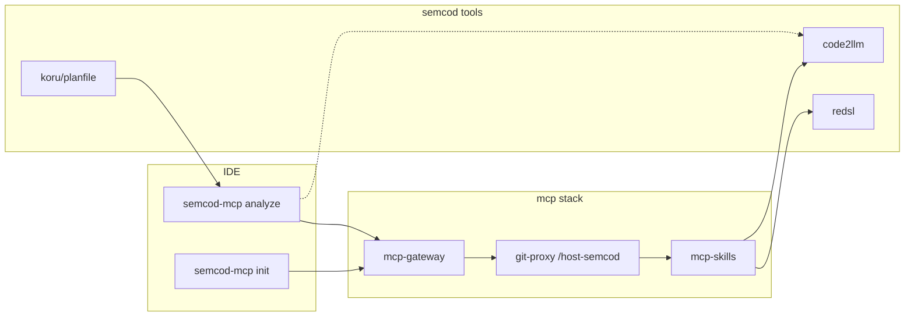

# semcod-mcp i ekosystem semcod/*

**Powiązane:** [SEMCOD_MCP_CLI.md](SEMCOD_MCP_CLI.md) · [USAGE.md](USAGE.md) · [GATEWAY_MODULE_SPLIT.md](GATEWAY_MODULE_SPLIT.md)

`semcod-mcp` to **punkt wejścia IDE** do stacku [mcp](https://github.com/semcod/mcp). Nie jest izolowanym narzędziem — współpracuje z całym katalogiem paczek semcod (code2llm, koru, planfile, goal, wup, …).

---

## Po co semcod-mcp (nawet przy jednym stacku)

| Korzyść | Jak |
|---------|-----|
| **Init jednym poleceniem** | Cursor, VS Code, Windsurf, Continue — spójny MCP + manifest `.semcod-mcp.yaml` |
| **Doctor** | Docker + gateway + manifest w jednej tabeli |
| **Analyze na working tree** | `Source: /host-semcod/...` — sync z live katalogu, **bez commita** |
| **Fallback code2llm** | `semcod-mcp analyze --local` gdy gateway offline |
| **Deinit** | Cofnięcie integracji bez kasowania innych MCP |
| **Most do paczek** | Gateway `mcp-skills/tool` uruchamia sumd, code2llm, redsl, vallm, … |

`make smoke` sprawdza stack; `semcod-mcp` sprawdza **Twój projekt** i **IDE**.

---

## Analiza bez commita — jak to działa

Stack montuje katalog nadrzędny do git-proxy:

```yaml
# docker-compose.yml (mcp-git-proxy)
volumes:
  - ..:/host-semcod:ro
```

`semcod-mcp analyze` (domyślnie) mapuje katalog projektu:

```
~/github/semcod/mcp  →  Source: /host-semcod/mcp
```

Gateway przekazuje `source_path` do git-proxy → **materializacja bieżących plików** → mcp-skills analyze / code2llm w kontenerze.

```bash
cd ~/github/semcod/mcp
semcod-mcp analyze --task "Hotspoty po splicie gateway"
# domyślnie: sync_mode (bez kolejki), live source_path

semcod-mcp analyze --local          # code2llm bezpośrednio na working tree (host)
semcod-mcp analyze --async          # job w tle (Redis/RQ)
semcod-mcp analyze --no-source      # tylko repo w git-proxy (po sync/commit)
```

---

## Mapowanie: semcod-mcp → paczki pomocnicze

### Automatyzacja i SDLC

| Paczka | Rola z semcod-mcp |
|--------|-------------------|
| [koru](https://github.com/semcod/koru) | Closed-loop across repos — pętle po `analyze` / `refactor` |
| [planfile](https://github.com/semcod/planfile) | Tickety SDLC, CI, bug-fix loops — plan z analyze |
| [goal](https://github.com/semcod/goal) | Commit intelligence przed push |
| [tagi](https://github.com/semcod/tagi) | Orkiestracja shipmentów git |

### Analiza kodu (lokalna i przez gateway)

| Paczka | Dostęp |
|--------|--------|
| [code2llm](https://github.com/semcod/code2llm) | `analyze --local`, `wygeneruj code2llm dla …`, `/tools/run` |
| [code2logic](https://github.com/semcod/code2logic) | model `mcp-skills/tool` |
| [redsl](https://github.com/semcod/redsl) | refactor workflow w gateway |
| [redup](https://github.com/semcod/redup) | duplikaty — `vallm` / code2llm HEALTH |
| [pyqual](https://github.com/semcod/pyqual) | `doctor` sprawdza obecność w PATH |
| [vallm](https://github.com/semcod/vallm) | walidacja wygenerowanego kodu |

### Watch / iteracja

| Paczka | Rola |
|--------|------|
| [wup](https://github.com/semcod/wup) | File watcher + regresja na niezacommitowanych zmianach |
| [wupbro](https://github.com/semcod/wupbro) | Dashboard do WUP |
| [regix](https://github.com/semcod/regix) | Regression index między wersjami |

### Dokumentacja i kontekst LLM

| Paczka | Rola |
|--------|------|
| [sumd](https://github.com/semcod/sumd) | SUMD/SUMR — mapa projektu dla agenta |
| [code2docs](https://github.com/semcod/code2docs) | Docs z kodu |
| [env2llm](https://github.com/semcod/env2llm) | Mapa env dla LLM |
| [toonic](https://github.com/semcod/toonic) | TOON dla kontekstu |

### W czacie (bez CLI)

```
Repo: semcod/mcp
Source: /host-semcod/mcp
Zadanie: Przeanalizuj złożoność po refaktorze
```

lub:

```
wygeneruj code2llm dla semcod/mcp
```

---

## Typowy workflow (semcod + MCP)



1. `semcod-mcp init` — podłączenie IDE  
2. `make start` + `semcod-mcp doctor`  
3. Edycja kodu (bez commita)  
4. `semcod-mcp analyze` — metryki z **bieżącego** drzewa  
5. Opcjonalnie: **koru** / **planfile** na pętlę naprawczą, **goal** na commit, **wup** na regresję  

---

## Korekta mitu „trzeba commitować”

**Nie trzeba.** Stary wynik analyze (np. `server.py` 3193 L) pochodził z **braku `source_path`** w CLI — git-proxy używał wcześniej zsynchronizowanego snapshotu. Po poprawce `semcod-mcp analyze` przekazuje `Source: /host-semcod/<projekt>` i wynik odzwierciedla working tree.

Pełna lista paczek: [semcod.github.io](https://semcod.github.io/).
