# System Architecture Analysis

## Overview

- **Project**: /home/tom/github/semcod/mcp/git2mcp
- **Primary Language**: python
- **Languages**: python: 5, txt: 4, shell: 1, toml: 1
- **Analysis Mode**: static
- **Total Functions**: 19
- **Total Classes**: 2
- **Modules**: 11
- **Entry Points**: 19

## Architecture by Module

### git2mcp.proxy
- **Functions**: 10
- **Classes**: 1
- **File**: `proxy.py`

### git2mcp.client
- **Functions**: 9
- **Classes**: 1
- **File**: `client.py`

## Key Entry Points

Main execution flows into the system:

### git2mcp.proxy.GitProxyManager.sync_repo
- **Calls**: self._repo_path, Path, repo_path.parent.mkdir, repo_path.exists, None.exists, str, source.exists, FileNotFoundError

### git2mcp.proxy.GitProxyManager.export_fragments
- **Calls**: self._repo_path, Repo, repo.commit, tree.traverse, repo_path.exists, FileNotFoundError, blob.data_stream.read, None.decode

### git2mcp.proxy.GitProxyManager.export_package
- **Calls**: self._repo_path, Repo, repo.commit, io.BytesIO, None.decode, repo_path.exists, FileNotFoundError, tarfile.open

### git2mcp.proxy.GitProxyManager.commit_changes
- **Calls**: self._repo_path, Repo, Actor, repo.index.commit, repo_path.exists, FileNotFoundError, change.get, change.get

### git2mcp.proxy.GitProxyManager._allow_local_repo_url
- **Calls**: repo_url.startswith, Path, urlparse, unquote, repo_url.startswith, path.exists, path.is_dir, None.exists

### git2mcp.proxy.GitProxyManager.push
- **Calls**: self._repo_path, Repo, repo.remote, list, remote_ref.push, repo_path.exists, FileNotFoundError, self._allow_local_repo_url

### git2mcp.client.Git2MCPClient._request
- **Calls**: range, RuntimeError, response.raise_for_status, response.json, httpx.AsyncClient, client.request, asyncio.sleep

### git2mcp.proxy.GitProxyManager.list_repos
- **Calls**: self.base_dir.glob, repo_root.relative_to, Repo, repos.append, str, str

### git2mcp.proxy.GitProxyManager.__init__
- **Calls**: Path, Path, self.base_dir.mkdir, self.cache_dir.mkdir

### git2mcp.client.Git2MCPClient.__init__
- **Calls**: base_url.rstrip

### git2mcp.client.Git2MCPClient.health
- **Calls**: self._request

### git2mcp.client.Git2MCPClient.list_repos
- **Calls**: self._request

### git2mcp.client.Git2MCPClient.sync_repo
- **Calls**: self._request

### git2mcp.client.Git2MCPClient.export_package
- **Calls**: self._request

### git2mcp.client.Git2MCPClient.commit_changes
- **Calls**: self._request

### git2mcp.client.Git2MCPClient.run_tests
- **Calls**: self._request

### git2mcp.client.Git2MCPClient.push
- **Calls**: self._request

### git2mcp.proxy.GitProxyManager._ensure_parent
- **Calls**: path.parent.mkdir

### git2mcp.proxy.GitProxyManager._repo_path

## Process Flows

Key execution flows identified:

### Flow 1: sync_repo
```
sync_repo [git2mcp.proxy.GitProxyManager]
```

### Flow 2: export_fragments
```
export_fragments [git2mcp.proxy.GitProxyManager]
```

### Flow 3: export_package
```
export_package [git2mcp.proxy.GitProxyManager]
```

### Flow 4: commit_changes
```
commit_changes [git2mcp.proxy.GitProxyManager]
```

### Flow 5: _allow_local_repo_url
```
_allow_local_repo_url [git2mcp.proxy.GitProxyManager]
```

### Flow 6: push
```
push [git2mcp.proxy.GitProxyManager]
```

### Flow 7: _request
```
_request [git2mcp.client.Git2MCPClient]
```

### Flow 8: list_repos
```
list_repos [git2mcp.proxy.GitProxyManager]
```

### Flow 9: __init__
```
__init__ [git2mcp.proxy.GitProxyManager]
```

### Flow 10: health
```
health [git2mcp.client.Git2MCPClient]
```

## Key Classes

### git2mcp.proxy.GitProxyManager
- **Methods**: 10
- **Key Methods**: git2mcp.proxy.GitProxyManager.__init__, git2mcp.proxy.GitProxyManager._repo_path, git2mcp.proxy.GitProxyManager._ensure_parent, git2mcp.proxy.GitProxyManager._allow_local_repo_url, git2mcp.proxy.GitProxyManager.list_repos, git2mcp.proxy.GitProxyManager.sync_repo, git2mcp.proxy.GitProxyManager.export_package, git2mcp.proxy.GitProxyManager.export_fragments, git2mcp.proxy.GitProxyManager.commit_changes, git2mcp.proxy.GitProxyManager.push

### git2mcp.client.Git2MCPClient
- **Methods**: 9
- **Key Methods**: git2mcp.client.Git2MCPClient.__init__, git2mcp.client.Git2MCPClient._request, git2mcp.client.Git2MCPClient.health, git2mcp.client.Git2MCPClient.list_repos, git2mcp.client.Git2MCPClient.sync_repo, git2mcp.client.Git2MCPClient.export_package, git2mcp.client.Git2MCPClient.commit_changes, git2mcp.client.Git2MCPClient.run_tests, git2mcp.client.Git2MCPClient.push

## Data Transformation Functions

Key functions that process and transform data:

## Public API Surface

Functions exposed as public API (no underscore prefix):

- `git2mcp.proxy.GitProxyManager.sync_repo` - 37 calls
- `git2mcp.proxy.GitProxyManager.export_fragments` - 18 calls
- `git2mcp.proxy.GitProxyManager.export_package` - 17 calls
- `git2mcp.proxy.GitProxyManager.commit_changes` - 14 calls
- `git2mcp.proxy.GitProxyManager.push` - 9 calls
- `git2mcp.proxy.GitProxyManager.list_repos` - 6 calls
- `git2mcp.client.Git2MCPClient.health` - 1 calls
- `git2mcp.client.Git2MCPClient.list_repos` - 1 calls
- `git2mcp.client.Git2MCPClient.sync_repo` - 1 calls
- `git2mcp.client.Git2MCPClient.export_package` - 1 calls
- `git2mcp.client.Git2MCPClient.commit_changes` - 1 calls
- `git2mcp.client.Git2MCPClient.run_tests` - 1 calls
- `git2mcp.client.Git2MCPClient.push` - 1 calls

## System Interactions

How components interact:

```mermaid
graph TD
    sync_repo --> _repo_path
    sync_repo --> Path
    sync_repo --> mkdir
    sync_repo --> exists
    export_fragments --> _repo_path
    export_fragments --> Repo
    export_fragments --> commit
    export_fragments --> traverse
    export_fragments --> exists
    export_package --> _repo_path
    export_package --> Repo
    export_package --> commit
    export_package --> BytesIO
    export_package --> decode
    commit_changes --> _repo_path
    commit_changes --> Repo
    commit_changes --> Actor
    commit_changes --> commit
    commit_changes --> exists
    _allow_local_repo_ur --> startswith
    _allow_local_repo_ur --> Path
    _allow_local_repo_ur --> urlparse
    _allow_local_repo_ur --> unquote
    push --> _repo_path
    push --> Repo
    push --> remote
    push --> list
    push --> push
    _request --> range
    _request --> RuntimeError
```



## Reverse Engineering Guidelines

1. **Entry Points**: Start analysis from the entry points listed above
2. **Core Logic**: Focus on classes with many methods
3. **Data Flow**: Follow data transformation functions
4. **Process Flows**: Use the flow diagrams for execution paths
5. **API Surface**: Public API functions reveal the interface

## Context for LLM

Maintain the identified architectural patterns and public API surface when suggesting changes.