# System Architecture Analysis
<!-- generated in 0.00s -->

## Overview

- **Project**: /home/tom/github/semcod/mcp
- **Primary Language**: python
- **Languages**: python: 38, yaml: 9, yml: 7, shell: 7, txt: 6
- **Analysis Mode**: static
- **Total Functions**: 401
- **Total Classes**: 56
- **Modules**: 84
- **Entry Points**: 274

## Architecture by Module

### mcp-gateway.server
- **Functions**: 86
- **Classes**: 2
- **File**: `server.py`

### mcp-skills.server
- **Functions**: 30
- **Classes**: 8
- **File**: `server.py`

### mcp-git-proxy.server
- **Functions**: 22
- **Classes**: 19
- **File**: `server.py`

### git2mcp.git2mcp.proxy
- **Functions**: 21
- **Classes**: 1
- **File**: `proxy.py`

### git2mcp.git2mcp.client
- **Functions**: 20
- **Classes**: 1
- **File**: `client.py`

### scripts.generate_demo_repos
- **Functions**: 19
- **File**: `generate_demo_repos.sh`

### mcp-webui.server
- **Functions**: 19
- **File**: `server.py`

### scripts.test
- **Functions**: 17
- **Classes**: 1
- **File**: `test.sh`

### llm-agent.agent_standalone
- **Functions**: 14
- **Classes**: 3
- **File**: `agent_standalone.py`

### llm-agent.agent_git2mcp
- **Functions**: 13
- **Classes**: 3
- **File**: `agent_git2mcp.py`

### env2mcp.env2mcp.config
- **Functions**: 13
- **Classes**: 1
- **File**: `config.py`

### llm-agent.agent
- **Functions**: 13
- **Classes**: 2
- **File**: `agent.py`

### scripts.refactor-last-repo
- **Functions**: 12
- **File**: `refactor-last-repo.sh`

### env2mcp.env2mcp.github_cli
- **Functions**: 11
- **Classes**: 1
- **File**: `github_cli.py`

### dashboard.server
- **Functions**: 10
- **Classes**: 2
- **File**: `server.py`

### gh2mcp.gh2mcp.server
- **Functions**: 10
- **Classes**: 5
- **File**: `server.py`

### env2mcp.env2mcp.cli
- **Functions**: 8
- **File**: `cli.py`

### scripts.deploy
- **Functions**: 7
- **File**: `deploy.sh`

### gh2mcp.gh2mcp.sync
- **Functions**: 7
- **Classes**: 1
- **File**: `sync.py`

### mcp-docs.server
- **Functions**: 7
- **File**: `server.py`

## Key Entry Points

Main execution flows into the system:

### mcp-gateway.server.chat_completions
- **Calls**: app.post, Depends, mcp-gateway.server._save_job, mcp-gateway.server.audit, next, mcp-gateway.server.parse_prompt_context, mcp-gateway.server._is_github_token_save_command, mcp-gateway.server._is_github_token_sync_command

### git2mcp.examples.05_local_iterate.main
- **Calls**: argparse.ArgumentParser, parser.add_argument, parser.add_argument, parser.add_argument, parser.add_argument, parser.add_argument, parser.add_argument, parser.add_argument

### env2mcp.env2mcp.config.EnvConfig.save
> Save configuration to .env file.
- **Calls**: lines.append, lines.append, lines.append, any, any, any, self.env_path.write_text, self.env_path.exists

### mcp-skills.server.MCPSkillsServer._sync_from_git_proxy
- **Calls**: target_repo.mkdir, str, httpx.AsyncClient, path.relative_to, target_repo.rglob, path.is_file, fragments_response.raise_for_status, fragments_response.json

### mcp-skills.server.redsl_refactor
> Uruchom redsl refactor na zsynchronizowanym repo z git-proxy.

Kroki:
1. Synchronizuj repo z git-proxy do katalogu skills cache
2. Uruchom `redsl refa
- **Calls**: app.post, Path, asyncio.get_event_loop, redsl_result.get, payload.get, payload.get, payload.get, loop.run_in_executor

### gh2mcp.gh2mcp.sync.GitHubTokenSyncService.get_recent_repos
- **Calls**: GitHubCLI, gh.get_user, max, candidates.sort, env2mcp.env2mcp.config.EnvConfig.set, gh.is_available, int, min

### git2mcp.git2mcp.proxy.GitProxyManager.sync_repo
- **Calls**: self._repo_path, Path, repo_path.parent.mkdir, repo_path.exists, None.exists, str, source.exists, FileNotFoundError

### env2mcp.env2mcp.cli.main
> Main entry point for CLI.
- **Calls**: argparse.ArgumentParser, parser.add_argument, parser.add_argument, parser.add_subparsers, subparsers.add_parser, github_parser.add_subparsers, github_subparsers.add_parser, login_parser.set_defaults

### mcp-skills.server.MCPSkillsServer._detect_code_patterns
> Wykrywanie wzorców kodu i antywzorców
- **Calls**: arguments.get, arguments.get, arguments.get, repo_path.rglob, all_imports.items, str, Path, repo_path.exists

### mcp-webui.server.github_fetch_token_from_cli
> Read GitHub token from gh CLI (via env2mcp) and save to .env.
- **Calls**: app.post, mcp-webui.server._get_github_config, templates.TemplateResponse, templates.TemplateResponse, GitHubCLI, httpx.AsyncClient, mcp-webui.server._get_github_config, templates.TemplateResponse

### mcp-skills.server.MCPSkillsServer._compute_metrics_for_repo
> Obliczanie metryk dla całego repozytorium
- **Calls**: arguments.get, arguments.get, arguments.get, file_metrics.sort, str, ValueError, Path, repo_path.exists

### mcp-skills.server.MCPSkillsServer._recommend_refactoring
> Generowanie rekomendacji refaktoryzacji
- **Calls**: arguments.get, arguments.get, arguments.get, arguments.get, json.loads, metrics.get, str, Path

### mcp-skills.server.MCPSkillsServer._analyze_code_structure
> Analiza struktury kodu dla podanych ścieżek
- **Calls**: arguments.get, arguments.get, arguments.get, str, ValueError, Path, TextContent, full_path.exists

### gh2mcp.gh2mcp.sync.GitHubTokenSyncService.get_last_pushed_repo
- **Calls**: GitHubCLI, EnvConfig, None.strip, max, valid_repos.sort, gh.is_available, None.strip, None.strip

### llm-agent.agent_standalone.LocalCodeAnalyzer.detect_code_patterns
> Wykrywanie wzorców kodu i antywzorców
- **Calls**: repo_path.rglob, all_imports.items, repo_path.exists, str, str, None.append, len, len

### mcp-git-proxy.server.github_create_repo
> Create a new repository on GitHub via REST API, then optionally clone it locally.
- **Calls**: app.post, None.encode, os.getenv, urllib.request.Request, os.getenv, os.getenv, HTTPException, repo_data.get

### llm-agent.agent_git2mcp.CachedCodeAnalyzer.compute_metrics
- **Calls**: self._repo_path, files.sort, len, repo.exists, repo.rglob, text.splitlines, sum, sum

### env2mcp.env2mcp.cli.cmd_github_status
> Check GitHub authentication status.
- **Calls**: GitHubCLI, gh.get_auth_status, status.get, EnvConfig, gh.is_available, scripts.test.print, scripts.test.print, scripts.test.print

### llm-agent.agent_standalone.LocalCodeAnalyzer.compute_metrics_for_repo
> Obliczanie metryk dla całego repozytorium
- **Calls**: file_metrics.sort, repo_path.exists, repo_path.rglob, str, content.splitlines, len, sum, sum

### mcp-webui.server.github_configure
> Configure or clear GitHub token.
- **Calls**: app.post, Form, Form, RedirectResponse, RedirectResponse, RedirectResponse, Path, EnvConfig

### llm-agent.agent_git2mcp.CachedCodeAnalyzer.detect_patterns
- **Calls**: self._repo_path, repo.rglob, repo.exists, file_path.read_text, text.splitlines, str, sorted, file_path.relative_to

### llm-agent.agent_standalone.main
> Główna funkcja agenta
- **Calls**: argparse.ArgumentParser, parser.add_argument, parser.add_argument, parser.add_argument, parser.add_argument, parser.add_argument, parser.parse_args, RefactoringAgent

### llm-agent.agent_git2mcp.main
- **Calls**: argparse.ArgumentParser, parser.add_argument, parser.add_argument, parser.add_argument, parser.add_argument, parser.add_argument, parser.add_argument, parser.add_argument

### llm-agent.agent_standalone.LocalCodeAnalyzer.analyze_code_structure
> Analiza struktury kodu dla podanych ścieżek
- **Calls**: full_path.exists, results.append, content.splitlines, len, results.append, full_path.open, f.read, line.strip

### llm-agent.agent_standalone.LocalCodeAnalyzer.recommend_refactoring
> Generowanie rekomendacji refaktoryzacji
- **Calls**: self.compute_metrics_for_repo, self.detect_code_patterns, metrics.get, metrics.get, recommendations.append, recommendations.append, metrics.get, recommendations.append

### git2mcp.examples.03_agent_git2mcp.main
- **Calls**: argparse.ArgumentParser, parser.add_argument, parser.add_argument, parser.add_argument, parser.add_argument, parser.add_argument, parser.add_argument, parser.parse_args

### git2mcp.examples.01_sync_and_commit.main
- **Calls**: argparse.ArgumentParser, parser.add_argument, parser.add_argument, parser.add_argument, parser.add_argument, parser.parse_args, scripts.test.print, httpx.AsyncClient

### mcp-webui.server.github_create_repo
> Create a new repository on GitHub.
- **Calls**: app.post, Form, Form, Form, Form, mcp-webui.server._resolve_github_token, mcp-webui.server._get_github_config, templates.TemplateResponse

### git2mcp.git2mcp.proxy.GitProxyManager.export_fragments
- **Calls**: self._repo_path, Repo, repo.commit, tree.traverse, repo_path.exists, FileNotFoundError, blob.data_stream.read, None.decode

### mcp-webui.server.github_clone
> Clone a repository from GitHub.
- **Calls**: app.post, Form, Form, Form, mcp-webui.server._normalize_github_url, mcp-webui.server._resolve_github_token, mcp-webui.server._get_github_config, templates.TemplateResponse

## Process Flows

Key execution flows identified:

### Flow 1: chat_completions
```
chat_completions [mcp-gateway.server]
  └─> _save_job
      └─> _get_state_redis_client
      └─> _job_storage_key
  └─> audit
```

### Flow 2: main
```
main [git2mcp.examples.05_local_iterate]
```

### Flow 3: save
```
save [env2mcp.env2mcp.config.EnvConfig]
```

### Flow 4: _sync_from_git_proxy
```
_sync_from_git_proxy [mcp-skills.server.MCPSkillsServer]
```

### Flow 5: redsl_refactor
```
redsl_refactor [mcp-skills.server]
```

### Flow 6: get_recent_repos
```
get_recent_repos [gh2mcp.gh2mcp.sync.GitHubTokenSyncService]
  └─ →> set
```

### Flow 7: sync_repo
```
sync_repo [git2mcp.git2mcp.proxy.GitProxyManager]
```

### Flow 8: _detect_code_patterns
```
_detect_code_patterns [mcp-skills.server.MCPSkillsServer]
```

### Flow 9: github_fetch_token_from_cli
```
github_fetch_token_from_cli [mcp-webui.server]
  └─> _get_github_config
      └─> _resolve_github_token
      └─> _read_gh2mcp_status
```

### Flow 10: _compute_metrics_for_repo
```
_compute_metrics_for_repo [mcp-skills.server.MCPSkillsServer]
```

## Key Classes

### git2mcp.git2mcp.proxy.GitProxyManager
- **Methods**: 21
- **Key Methods**: git2mcp.git2mcp.proxy.GitProxyManager.__init__, git2mcp.git2mcp.proxy.GitProxyManager._repo_path, git2mcp.git2mcp.proxy.GitProxyManager._ensure_parent, git2mcp.git2mcp.proxy.GitProxyManager._allow_local_repo_url, git2mcp.git2mcp.proxy.GitProxyManager.list_repos, git2mcp.git2mcp.proxy.GitProxyManager.sync_repo, git2mcp.git2mcp.proxy.GitProxyManager.export_package, git2mcp.git2mcp.proxy.GitProxyManager.export_fragments, git2mcp.git2mcp.proxy.GitProxyManager.commit_changes, git2mcp.git2mcp.proxy.GitProxyManager.push

### git2mcp.git2mcp.client.Git2MCPClient
- **Methods**: 20
- **Key Methods**: git2mcp.git2mcp.client.Git2MCPClient.__init__, git2mcp.git2mcp.client.Git2MCPClient._request, git2mcp.git2mcp.client.Git2MCPClient.health, git2mcp.git2mcp.client.Git2MCPClient.list_repos, git2mcp.git2mcp.client.Git2MCPClient.sync_repo, git2mcp.git2mcp.client.Git2MCPClient.export_package, git2mcp.git2mcp.client.Git2MCPClient.commit_changes, git2mcp.git2mcp.client.Git2MCPClient.run_tests, git2mcp.git2mcp.client.Git2MCPClient.push, git2mcp.git2mcp.client.Git2MCPClient.reset

### llm-agent.agent.RefactoringAgent
> Autonomiczny Agent Refaktoryzacji
Łączy się z MCP Git Server i MCP Skills Server
- **Methods**: 12
- **Key Methods**: llm-agent.agent.RefactoringAgent.__init__, llm-agent.agent.RefactoringAgent.connect_skills, llm-agent.agent.RefactoringAgent.connect_git_mcp, llm-agent.agent.RefactoringAgent.analyze_repository, llm-agent.agent.RefactoringAgent.generate_refactoring_plan, llm-agent.agent.RefactoringAgent._build_refactoring_prompt, llm-agent.agent.RefactoringAgent._call_openai, llm-agent.agent.RefactoringAgent._call_ollama, llm-agent.agent.RefactoringAgent._mock_llm_response, llm-agent.agent.RefactoringAgent._mock_llm_response_from_prompt

### env2mcp.env2mcp.config.EnvConfig
> Manages .env file configuration.
- **Methods**: 11
- **Key Methods**: env2mcp.env2mcp.config.EnvConfig.__init__, env2mcp.env2mcp.config.EnvConfig._load, env2mcp.env2mcp.config.EnvConfig.get, env2mcp.env2mcp.config.EnvConfig.set, env2mcp.env2mcp.config.EnvConfig.remove, env2mcp.env2mcp.config.EnvConfig._format_value, env2mcp.env2mcp.config.EnvConfig.save, env2mcp.env2mcp.config.EnvConfig.__contains__, env2mcp.env2mcp.config.EnvConfig.__getitem__, env2mcp.env2mcp.config.EnvConfig.__setitem__

### mcp-skills.server.MCPSkillsServer
> Serwer MCP Skills z narzędziami do analizy kodu
- **Methods**: 11
- **Key Methods**: mcp-skills.server.MCPSkillsServer.__init__, mcp-skills.server.MCPSkillsServer._sync_from_git_proxy, mcp-skills.server.MCPSkillsServer._setup_handlers, mcp-skills.server.MCPSkillsServer._handle_list_tools, mcp-skills.server.MCPSkillsServer._handle_call_tool, mcp-skills.server.MCPSkillsServer._analyze_code_structure, mcp-skills.server.MCPSkillsServer._compute_metrics_for_repo, mcp-skills.server.MCPSkillsServer._detect_code_patterns, mcp-skills.server.MCPSkillsServer._sync_repo_tool, mcp-skills.server.MCPSkillsServer._recommend_refactoring

### env2mcp.env2mcp.github_cli.GitHubCLI
> Interface to GitHub CLI (gh) tool.
- **Methods**: 9
- **Key Methods**: env2mcp.env2mcp.github_cli.GitHubCLI.__init__, env2mcp.env2mcp.github_cli.GitHubCLI.is_available, env2mcp.env2mcp.github_cli.GitHubCLI.get_auth_status, env2mcp.env2mcp.github_cli.GitHubCLI.get_token, env2mcp.env2mcp.github_cli.GitHubCLI.get_user, env2mcp.env2mcp.github_cli.GitHubCLI.login, env2mcp.env2mcp.github_cli.GitHubCLI.logout, env2mcp.env2mcp.github_cli.GitHubCLI.list_repos, env2mcp.env2mcp.github_cli.GitHubCLI.clone_url

### dashboard.server.DashboardHandler
> Custom HTTP handler for dashboard
- **Methods**: 9
- **Key Methods**: dashboard.server.DashboardHandler.end_headers, dashboard.server.DashboardHandler.do_GET, dashboard.server.DashboardHandler.serve_file, dashboard.server.DashboardHandler.send_json, dashboard.server.DashboardHandler.get_content_type, dashboard.server.DashboardHandler.get_status, dashboard.server.DashboardHandler.get_analyses, dashboard.server.DashboardHandler.get_analysis, dashboard.server.DashboardHandler.get_repos
- **Inherits**: http.server.SimpleHTTPRequestHandler

### llm-agent.agent_standalone.RefactoringAgent
> Autonomiczny Agent Refaktoryzacji - Standalone
- **Methods**: 8
- **Key Methods**: llm-agent.agent_standalone.RefactoringAgent.__init__, llm-agent.agent_standalone.RefactoringAgent.analyze_repository, llm-agent.agent_standalone.RefactoringAgent.generate_refactoring_plan, llm-agent.agent_standalone.RefactoringAgent._build_refactoring_prompt, llm-agent.agent_standalone.RefactoringAgent._call_openai_sync, llm-agent.agent_standalone.RefactoringAgent._mock_llm_response, llm-agent.agent_standalone.RefactoringAgent._mock_llm_response_from_prompt, llm-agent.agent_standalone.RefactoringAgent.execute_refactoring_workflow

### gh2mcp.gh2mcp.sync.GitHubTokenSyncService
- **Methods**: 7
- **Key Methods**: gh2mcp.gh2mcp.sync.GitHubTokenSyncService.__init__, gh2mcp.gh2mcp.sync.GitHubTokenSyncService.get_status, gh2mcp.gh2mcp.sync.GitHubTokenSyncService.set_org, gh2mcp.gh2mcp.sync.GitHubTokenSyncService.list_orgs_and_repos, gh2mcp.gh2mcp.sync.GitHubTokenSyncService.get_last_pushed_repo, gh2mcp.gh2mcp.sync.GitHubTokenSyncService.get_recent_repos, gh2mcp.gh2mcp.sync.GitHubTokenSyncService.sync_token

### llm-agent.agent_git2mcp.CachedCodeAnalyzer
- **Methods**: 6
- **Key Methods**: llm-agent.agent_git2mcp.CachedCodeAnalyzer.__init__, llm-agent.agent_git2mcp.CachedCodeAnalyzer._repo_path, llm-agent.agent_git2mcp.CachedCodeAnalyzer.import_package, llm-agent.agent_git2mcp.CachedCodeAnalyzer.compute_metrics, llm-agent.agent_git2mcp.CachedCodeAnalyzer.detect_patterns, llm-agent.agent_git2mcp.CachedCodeAnalyzer.recommend_refactoring

### llm-agent.agent_git2mcp.Git2MCPRefactoringAgent
- **Methods**: 6
- **Key Methods**: llm-agent.agent_git2mcp.Git2MCPRefactoringAgent.__init__, llm-agent.agent_git2mcp.Git2MCPRefactoringAgent.sync_and_cache_repo, llm-agent.agent_git2mcp.Git2MCPRefactoringAgent.analyze, llm-agent.agent_git2mcp.Git2MCPRefactoringAgent.generate_plan, llm-agent.agent_git2mcp.Git2MCPRefactoringAgent.build_commit_changes, llm-agent.agent_git2mcp.Git2MCPRefactoringAgent.execute

### llm-agent.agent_standalone.LocalCodeAnalyzer
> Lokalny analizator kodu - implementacja MCP Skills lokalnie
- **Methods**: 5
- **Key Methods**: llm-agent.agent_standalone.LocalCodeAnalyzer.__init__, llm-agent.agent_standalone.LocalCodeAnalyzer.analyze_code_structure, llm-agent.agent_standalone.LocalCodeAnalyzer.compute_metrics_for_repo, llm-agent.agent_standalone.LocalCodeAnalyzer.detect_code_patterns, llm-agent.agent_standalone.LocalCodeAnalyzer.recommend_refactoring

### semcod_mcp.validate.ValidationReport
- **Methods**: 3
- **Key Methods**: semcod_mcp.validate.ValidationReport.ok, semcod_mcp.validate.ValidationReport.error, semcod_mcp.validate.ValidationReport.warn

### semcod_mcp.doctor.DoctorReport
- **Methods**: 2
- **Key Methods**: semcod_mcp.doctor.DoctorReport.healthy, semcod_mcp.doctor.DoctorReport.add

### scripts.test.DataProcessor
- **Methods**: 0

### semcod_mcp.analyze.AnalyzeReport
- **Methods**: 0

### semcod_mcp.doctor.Check
- **Methods**: 0

### semcod_mcp.validate.ValidationIssue
- **Methods**: 0

### semcod_mcp.init_cmd.InitResult
- **Methods**: 0

### llm-agent.agent_git2mcp.AnalysisResult
- **Methods**: 0

## Data Transformation Functions

Key functions that process and transform data:

### scripts.refactor-last-repo.parse_args

### scripts.test.process

### scripts.test._transform

### gh2mcp.gh2mcp.cli.build_parser
- **Output to**: argparse.ArgumentParser, parser.add_argument, parser.add_subparsers, subparsers.add_parser, status.set_defaults

### semcod_mcp.cli.validate_cmd
> Validate local IDE integration files.
- **Output to**: main.command, click.argument, semcod_mcp.validate.run_validate, console.print, console.print

### semcod_mcp.validate._validate_mcp_json
- **Output to**: data.get, servers.get, path.is_file, report.warn, semcod_mcp.merge.load_json

### semcod_mcp.validate.run_validate
- **Output to**: project_dir.resolve, ValidationReport, semcod_mcp.paths.detect_stack_path, semcod_mcp.templates.read_manifest, continue_cfg.is_file

### env2mcp.env2mcp.config.EnvConfig._format_value
> Format a value for .env file.

Only quote values that contain spaces, special shell characters or ar
- **Output to**: re.compile, None.replace, _NEEDS_QUOTE.search, len, value.replace

### mcp-skills.server._parse_tool_result
- **Output to**: json.loads

### mcp-gateway.server.parse_prompt_context
- **Output to**: user_msg.splitlines, PROMPT_FIELD_REGEX.items, user_msg.strip, REPO_TEMPLATE_REGEX.match, GITHUB_REPO_SLUG_REGEX.search

### mcp-gateway.server.parse_bool
- **Output to**: None.lower, value.strip

### mcp-gateway.server.parse_tool_intent
> Detect requests like 'wygeneruj sumd dla <URL>' / 'run code2llm on owner/repo'.

Returns dict with k
- **Output to**: user_msg.strip, mcp-gateway.server._normalize_command_text, normalized.split, enumerate, any

## Behavioral Patterns

### state_machine_RefactoringAgent
- **Type**: state_machine
- **Confidence**: 0.70
- **Functions**: llm-agent.agent.RefactoringAgent.__init__, llm-agent.agent.RefactoringAgent.connect_skills, llm-agent.agent.RefactoringAgent.connect_git_mcp, llm-agent.agent.RefactoringAgent.analyze_repository, llm-agent.agent.RefactoringAgent.generate_refactoring_plan

## Public API Surface

Functions exposed as public API (no underscore prefix):

- `mcp-gateway.server.chat_completions` - 114 calls
- `git2mcp.examples.05_local_iterate.main` - 42 calls
- `mcp-gateway.server.dispatch_skill` - 41 calls
- `env2mcp.env2mcp.config.EnvConfig.save` - 39 calls
- `mcp-skills.server.redsl_refactor` - 39 calls
- `semcod_mcp.doctor.run_doctor` - 38 calls
- `gh2mcp.gh2mcp.sync.GitHubTokenSyncService.get_recent_repos` - 38 calls
- `semcod_mcp.init_cmd.run_init` - 37 calls
- `git2mcp.git2mcp.proxy.GitProxyManager.sync_repo` - 37 calls
- `env2mcp.env2mcp.cli.main` - 34 calls
- `mcp-webui.server.github_fetch_token_from_cli` - 32 calls
- `env2mcp.env2mcp.github_cli.configure_github` - 29 calls
- `gh2mcp.gh2mcp.sync.GitHubTokenSyncService.get_last_pushed_repo` - 26 calls
- `llm-agent.agent_standalone.LocalCodeAnalyzer.detect_code_patterns` - 25 calls
- `mcp-git-proxy.server.github_create_repo` - 25 calls
- `semcod_mcp.validate.run_validate` - 24 calls
- `llm-agent.agent_git2mcp.CachedCodeAnalyzer.compute_metrics` - 24 calls
- `env2mcp.env2mcp.cli.cmd_github_status` - 22 calls
- `semcod_mcp.analyze.run_analyze` - 22 calls
- `llm-agent.agent_standalone.LocalCodeAnalyzer.compute_metrics_for_repo` - 22 calls
- `mcp-webui.server.github_configure` - 21 calls
- `llm-agent.agent_git2mcp.CachedCodeAnalyzer.detect_patterns` - 21 calls
- `llm-agent.agent_standalone.main` - 21 calls
- `llm-agent.agent_git2mcp.main` - 20 calls
- `llm-agent.agent_standalone.LocalCodeAnalyzer.analyze_code_structure` - 20 calls
- `llm-agent.agent_standalone.LocalCodeAnalyzer.recommend_refactoring` - 20 calls
- `git2mcp.examples.03_agent_git2mcp.main` - 19 calls
- `mcp-gateway.server.message_content_to_text` - 19 calls
- `git2mcp.examples.01_sync_and_commit.main` - 18 calls
- `mcp-webui.server.github_create_repo` - 18 calls
- `git2mcp.git2mcp.proxy.GitProxyManager.export_fragments` - 18 calls
- `mcp-webui.server.github_clone` - 17 calls
- `git2mcp.git2mcp.proxy.GitProxyManager.export_package` - 17 calls
- `mcp-gateway.server.parse_tool_intent` - 17 calls
- `git2mcp.examples.04_dry_run_vs_execute.run` - 16 calls
- `gh2mcp.gh2mcp.sync.GitHubTokenSyncService.sync_token` - 16 calls
- `dashboard.server.DashboardHandler.do_GET` - 16 calls
- `llm-agent.agent.main` - 16 calls
- `mcp-git-proxy.server.sync_pull` - 16 calls
- `git2mcp.examples.02_fragment_sync_to_skills.main` - 15 calls

## System Interactions

How components interact:

```mermaid
graph TD
    chat_completions --> post
    chat_completions --> Depends
    chat_completions --> _save_job
    chat_completions --> audit
    chat_completions --> next
    main --> ArgumentParser
    main --> add_argument
    save --> append
    save --> any
    _sync_from_git_proxy --> mkdir
    _sync_from_git_proxy --> str
    _sync_from_git_proxy --> AsyncClient
    _sync_from_git_proxy --> relative_to
    _sync_from_git_proxy --> rglob
    redsl_refactor --> post
    redsl_refactor --> Path
    redsl_refactor --> get_event_loop
    redsl_refactor --> get
    get_recent_repos --> GitHubCLI
    get_recent_repos --> get_user
    get_recent_repos --> max
    get_recent_repos --> sort
    get_recent_repos --> set
    sync_repo --> _repo_path
    sync_repo --> Path
    sync_repo --> mkdir
    sync_repo --> exists
    main --> add_subparsers
    main --> add_parser
    _detect_code_pattern --> get
```



## Reverse Engineering Guidelines

1. **Entry Points**: Start analysis from the entry points listed above
2. **Core Logic**: Focus on classes with many methods
3. **Data Flow**: Follow data transformation functions
4. **Process Flows**: Use the flow diagrams for execution paths
5. **API Surface**: Public API functions reveal the interface

## Context for LLM

Maintain the identified architectural patterns and public API surface when suggesting changes.