# System Architecture Analysis

## Overview

- **Project**: /home/tom/github/semcod/mcp
- **Primary Language**: python
- **Languages**: python: 19, yaml: 13, txt: 6, shell: 5, yml: 2
- **Analysis Mode**: static
- **Total Functions**: 172
- **Total Classes**: 33
- **Modules**: 52
- **Entry Points**: 166

## Architecture by Module

### git2mcp.git2mcp.proxy
- **Functions**: 21
- **Classes**: 1
- **File**: `proxy.py`

### git2mcp.git2mcp.client
- **Functions**: 20
- **Classes**: 1
- **File**: `client.py`

### mcp-git-proxy.server
- **Functions**: 20
- **Classes**: 17
- **File**: `server.py`

### scripts.test
- **Functions**: 17
- **Classes**: 1
- **File**: `test.sh`

### llm-agent.agent_standalone
- **Functions**: 14
- **Classes**: 3
- **File**: `agent_standalone.py`

### llm-agent.agent_git2mcp
- **Functions**: 13
- **Classes**: 3
- **File**: `agent_git2mcp.py`

### llm-agent.agent
- **Functions**: 13
- **Classes**: 2
- **File**: `agent.py`

### mcp-skills.server
- **Functions**: 12
- **Classes**: 1
- **File**: `server.py`

### dashboard.server
- **Functions**: 10
- **Classes**: 2
- **File**: `server.py`

### mcp-gateway.server
- **Functions**: 10
- **Classes**: 2
- **File**: `server.py`

### mcp-webui.server
- **Functions**: 8
- **File**: `server.py`

### scripts.deploy
- **Functions**: 7
- **File**: `deploy.sh`

### git2mcp.project.map.toon
- **Functions**: 4
- **File**: `map.toon.yaml`

### git2mcp.examples.04_dry_run_vs_execute
- **Functions**: 2
- **File**: `04_dry_run_vs_execute.py`

### git2mcp.examples.02_fragment_sync_to_skills
- **Functions**: 1
- **File**: `02_fragment_sync_to_skills.py`

### git2mcp.examples.03_agent_git2mcp
- **Functions**: 1
- **File**: `03_agent_git2mcp.py`

### git2mcp.examples.05_local_iterate
- **Functions**: 1
- **File**: `05_local_iterate.py`

### git2mcp.examples.01_sync_and_commit
- **Functions**: 1
- **File**: `01_sync_and_commit.py`

## Key Entry Points

Main execution flows into the system:

### git2mcp.examples.05_local_iterate.main
- **Calls**: argparse.ArgumentParser, parser.add_argument, parser.add_argument, parser.add_argument, parser.add_argument, parser.add_argument, parser.add_argument, parser.add_argument

### mcp-skills.server.MCPSkillsServer._sync_from_git_proxy
- **Calls**: target_repo.mkdir, str, httpx.AsyncClient, path.relative_to, target_repo.rglob, path.is_file, fragments_response.raise_for_status, fragments_response.json

### git2mcp.git2mcp.proxy.GitProxyManager.sync_repo
- **Calls**: self._repo_path, Path, repo_path.parent.mkdir, repo_path.exists, None.exists, str, source.exists, FileNotFoundError

### mcp-skills.server.MCPSkillsServer._detect_code_patterns
> Wykrywanie wzorców kodu i antywzorców
- **Calls**: arguments.get, arguments.get, arguments.get, repo_path.rglob, all_imports.items, str, Path, repo_path.exists

### mcp-skills.server.MCPSkillsServer._compute_metrics_for_repo
> Obliczanie metryk dla całego repozytorium
- **Calls**: arguments.get, arguments.get, arguments.get, file_metrics.sort, str, ValueError, Path, repo_path.exists

### mcp-skills.server.MCPSkillsServer._recommend_refactoring
> Generowanie rekomendacji refaktoryzacji
- **Calls**: arguments.get, arguments.get, arguments.get, arguments.get, json.loads, metrics.get, str, Path

### mcp-skills.server.MCPSkillsServer._analyze_code_structure
> Analiza struktury kodu dla podanych ścieżek
- **Calls**: arguments.get, arguments.get, arguments.get, str, ValueError, Path, TextContent, full_path.exists

### mcp-gateway.server.chat_completions
- **Calls**: app.post, Depends, mcp-gateway.server.audit, next, HTTPException, None.get, HTTPException, uuid.uuid4

### llm-agent.agent_standalone.LocalCodeAnalyzer.detect_code_patterns
> Wykrywanie wzorców kodu i antywzorców
- **Calls**: repo_path.rglob, all_imports.items, repo_path.exists, str, str, None.append, len, len

### llm-agent.agent_git2mcp.CachedCodeAnalyzer.compute_metrics
- **Calls**: self._repo_path, files.sort, len, repo.exists, repo.rglob, text.splitlines, sum, sum

### llm-agent.agent_standalone.LocalCodeAnalyzer.compute_metrics_for_repo
> Obliczanie metryk dla całego repozytorium
- **Calls**: file_metrics.sort, repo_path.exists, repo_path.rglob, str, content.splitlines, len, sum, sum

### llm-agent.agent_git2mcp.CachedCodeAnalyzer.detect_patterns
- **Calls**: self._repo_path, repo.rglob, repo.exists, file_path.read_text, text.splitlines, str, sorted, file_path.relative_to

### llm-agent.agent_standalone.main
> Główna funkcja agenta
- **Calls**: argparse.ArgumentParser, parser.add_argument, parser.add_argument, parser.add_argument, parser.add_argument, parser.add_argument, parser.parse_args, RefactoringAgent

### llm-agent.agent_git2mcp.main
- **Calls**: argparse.ArgumentParser, parser.add_argument, parser.add_argument, parser.add_argument, parser.add_argument, parser.add_argument, parser.add_argument, parser.add_argument

### llm-agent.agent_standalone.LocalCodeAnalyzer.analyze_code_structure
> Analiza struktury kodu dla podanych ścieżek
- **Calls**: full_path.exists, results.append, content.splitlines, len, results.append, full_path.open, f.read, line.strip

### llm-agent.agent_standalone.LocalCodeAnalyzer.recommend_refactoring
> Generowanie rekomendacji refaktoryzacji
- **Calls**: self.compute_metrics_for_repo, self.detect_code_patterns, metrics.get, metrics.get, recommendations.append, recommendations.append, metrics.get, recommendations.append

### git2mcp.examples.03_agent_git2mcp.main
- **Calls**: argparse.ArgumentParser, parser.add_argument, parser.add_argument, parser.add_argument, parser.add_argument, parser.add_argument, parser.add_argument, parser.parse_args

### git2mcp.examples.01_sync_and_commit.main
- **Calls**: argparse.ArgumentParser, parser.add_argument, parser.add_argument, parser.add_argument, parser.add_argument, parser.parse_args, scripts.test.print, httpx.AsyncClient

### git2mcp.git2mcp.proxy.GitProxyManager.export_fragments
- **Calls**: self._repo_path, Repo, repo.commit, tree.traverse, repo_path.exists, FileNotFoundError, blob.data_stream.read, None.decode

### git2mcp.git2mcp.proxy.GitProxyManager.export_package
- **Calls**: self._repo_path, Repo, repo.commit, io.BytesIO, None.decode, repo_path.exists, FileNotFoundError, tarfile.open

### llm-agent.agent.RefactoringAgent._build_refactoring_prompt
> Buduje prompt dla LLM
- **Calls**: recs.get, metrics.get, metrics.get, metrics.get, metrics.get, metrics.get, metrics.get, None.get

### dashboard.server.DashboardHandler.do_GET
- **Calls**: urlparse, path.startswith, self.send_json, self.send_json, path.replace, self.send_json, self.send_json, path.lstrip

### llm-agent.agent.main
> Główna funkcja agenta
- **Calls**: argparse.ArgumentParser, parser.add_argument, parser.add_argument, parser.add_argument, parser.add_argument, parser.parse_args, RefactoringAgent, scripts.test.print

### llm-agent.agent_standalone.RefactoringAgent._build_refactoring_prompt
> Buduje prompt dla LLM
- **Calls**: recs.get, metrics.get, metrics.get, metrics.get, metrics.get, metrics.get, metrics.get, None.get

### git2mcp.examples.02_fragment_sync_to_skills.main
- **Calls**: argparse.ArgumentParser, parser.add_argument, parser.add_argument, parser.add_argument, parser.add_argument, parser.parse_args, subprocess.run, json.loads

### git2mcp.examples.04_dry_run_vs_execute.main
- **Calls**: argparse.ArgumentParser, parser.add_argument, parser.add_argument, parser.add_argument, parser.add_argument, parser.add_argument, parser.add_mutually_exclusive_group, group.add_argument

### llm-agent.agent_git2mcp.CachedCodeAnalyzer.import_package
- **Calls**: self._repo_path, target.exists, target.mkdir, base64.b64decode, sorted, tarfile.open, tar.extractall, target.glob

### git2mcp.git2mcp.proxy.GitProxyManager.commit_changes
- **Calls**: self._repo_path, Repo, Actor, repo.index.commit, repo_path.exists, FileNotFoundError, change.get, change.get

### llm-agent.agent.RefactoringAgent.analyze_repository
> Pełna analiza repozytorium używając MCP Skills
- **Calls**: logger.info, logger.info, json.loads, logger.info, json.loads, logger.info, json.loads, AnalysisResult

### git2mcp.git2mcp.proxy.GitProxyManager.worktree_write
- **Calls**: self._repo_path, None.resolve, self._ensure_parent, target.write_text, repo_path.exists, FileNotFoundError, None.startswith, ValueError

## Process Flows

Key execution flows identified:

### Flow 1: main
```
main [git2mcp.examples.05_local_iterate]
```

### Flow 2: _sync_from_git_proxy
```
_sync_from_git_proxy [mcp-skills.server.MCPSkillsServer]
```

### Flow 3: sync_repo
```
sync_repo [git2mcp.git2mcp.proxy.GitProxyManager]
```

### Flow 4: _detect_code_patterns
```
_detect_code_patterns [mcp-skills.server.MCPSkillsServer]
```

### Flow 5: _compute_metrics_for_repo
```
_compute_metrics_for_repo [mcp-skills.server.MCPSkillsServer]
```

### Flow 6: _recommend_refactoring
```
_recommend_refactoring [mcp-skills.server.MCPSkillsServer]
```

### Flow 7: _analyze_code_structure
```
_analyze_code_structure [mcp-skills.server.MCPSkillsServer]
```

### Flow 8: chat_completions
```
chat_completions [mcp-gateway.server]
  └─> audit
```

### Flow 9: detect_code_patterns
```
detect_code_patterns [llm-agent.agent_standalone.LocalCodeAnalyzer]
```

### Flow 10: compute_metrics
```
compute_metrics [llm-agent.agent_git2mcp.CachedCodeAnalyzer]
```

## Key Classes

### git2mcp.git2mcp.proxy.GitProxyManager
- **Methods**: 21
- **Key Methods**: git2mcp.git2mcp.proxy.GitProxyManager.__init__, git2mcp.git2mcp.proxy.GitProxyManager._repo_path, git2mcp.git2mcp.proxy.GitProxyManager._ensure_parent, git2mcp.git2mcp.proxy.GitProxyManager._allow_local_repo_url, git2mcp.git2mcp.proxy.GitProxyManager.list_repos, git2mcp.git2mcp.proxy.GitProxyManager.sync_repo, git2mcp.git2mcp.proxy.GitProxyManager.export_package, git2mcp.git2mcp.proxy.GitProxyManager.export_fragments, git2mcp.git2mcp.proxy.GitProxyManager.commit_changes, git2mcp.git2mcp.proxy.GitProxyManager.push

### git2mcp.git2mcp.client.Git2MCPClient
- **Methods**: 20
- **Key Methods**: git2mcp.git2mcp.client.Git2MCPClient.__init__, git2mcp.git2mcp.client.Git2MCPClient._request, git2mcp.git2mcp.client.Git2MCPClient.health, git2mcp.git2mcp.client.Git2MCPClient.list_repos, git2mcp.git2mcp.client.Git2MCPClient.sync_repo, git2mcp.git2mcp.client.Git2MCPClient.export_package, git2mcp.git2mcp.client.Git2MCPClient.commit_changes, git2mcp.git2mcp.client.Git2MCPClient.run_tests, git2mcp.git2mcp.client.Git2MCPClient.push, git2mcp.git2mcp.client.Git2MCPClient.reset

### llm-agent.agent.RefactoringAgent
> Autonomiczny Agent Refaktoryzacji
Łączy się z MCP Git Server i MCP Skills Server
- **Methods**: 12
- **Key Methods**: llm-agent.agent.RefactoringAgent.__init__, llm-agent.agent.RefactoringAgent.connect_skills, llm-agent.agent.RefactoringAgent.connect_git_mcp, llm-agent.agent.RefactoringAgent.analyze_repository, llm-agent.agent.RefactoringAgent.generate_refactoring_plan, llm-agent.agent.RefactoringAgent._build_refactoring_prompt, llm-agent.agent.RefactoringAgent._call_openai, llm-agent.agent.RefactoringAgent._call_ollama, llm-agent.agent.RefactoringAgent._mock_llm_response, llm-agent.agent.RefactoringAgent._mock_llm_response_from_prompt

### mcp-skills.server.MCPSkillsServer
> Serwer MCP Skills z narzędziami do analizy kodu
- **Methods**: 11
- **Key Methods**: mcp-skills.server.MCPSkillsServer.__init__, mcp-skills.server.MCPSkillsServer._sync_from_git_proxy, mcp-skills.server.MCPSkillsServer._setup_handlers, mcp-skills.server.MCPSkillsServer._handle_list_tools, mcp-skills.server.MCPSkillsServer._handle_call_tool, mcp-skills.server.MCPSkillsServer._analyze_code_structure, mcp-skills.server.MCPSkillsServer._compute_metrics_for_repo, mcp-skills.server.MCPSkillsServer._detect_code_patterns, mcp-skills.server.MCPSkillsServer._sync_repo_tool, mcp-skills.server.MCPSkillsServer._recommend_refactoring

### dashboard.server.DashboardHandler
> Custom HTTP handler for dashboard
- **Methods**: 9
- **Key Methods**: dashboard.server.DashboardHandler.end_headers, dashboard.server.DashboardHandler.do_GET, dashboard.server.DashboardHandler.serve_file, dashboard.server.DashboardHandler.send_json, dashboard.server.DashboardHandler.get_content_type, dashboard.server.DashboardHandler.get_status, dashboard.server.DashboardHandler.get_analyses, dashboard.server.DashboardHandler.get_analysis, dashboard.server.DashboardHandler.get_repos
- **Inherits**: http.server.SimpleHTTPRequestHandler

### llm-agent.agent_standalone.RefactoringAgent
> Autonomiczny Agent Refaktoryzacji - Standalone
- **Methods**: 8
- **Key Methods**: llm-agent.agent_standalone.RefactoringAgent.__init__, llm-agent.agent_standalone.RefactoringAgent.analyze_repository, llm-agent.agent_standalone.RefactoringAgent.generate_refactoring_plan, llm-agent.agent_standalone.RefactoringAgent._build_refactoring_prompt, llm-agent.agent_standalone.RefactoringAgent._call_openai_sync, llm-agent.agent_standalone.RefactoringAgent._mock_llm_response, llm-agent.agent_standalone.RefactoringAgent._mock_llm_response_from_prompt, llm-agent.agent_standalone.RefactoringAgent.execute_refactoring_workflow

### llm-agent.agent_git2mcp.CachedCodeAnalyzer
- **Methods**: 6
- **Key Methods**: llm-agent.agent_git2mcp.CachedCodeAnalyzer.__init__, llm-agent.agent_git2mcp.CachedCodeAnalyzer._repo_path, llm-agent.agent_git2mcp.CachedCodeAnalyzer.import_package, llm-agent.agent_git2mcp.CachedCodeAnalyzer.compute_metrics, llm-agent.agent_git2mcp.CachedCodeAnalyzer.detect_patterns, llm-agent.agent_git2mcp.CachedCodeAnalyzer.recommend_refactoring

### llm-agent.agent_git2mcp.Git2MCPRefactoringAgent
- **Methods**: 6
- **Key Methods**: llm-agent.agent_git2mcp.Git2MCPRefactoringAgent.__init__, llm-agent.agent_git2mcp.Git2MCPRefactoringAgent.sync_and_cache_repo, llm-agent.agent_git2mcp.Git2MCPRefactoringAgent.analyze, llm-agent.agent_git2mcp.Git2MCPRefactoringAgent.generate_plan, llm-agent.agent_git2mcp.Git2MCPRefactoringAgent.build_commit_changes, llm-agent.agent_git2mcp.Git2MCPRefactoringAgent.execute

### llm-agent.agent_standalone.LocalCodeAnalyzer
> Lokalny analizator kodu - implementacja MCP Skills lokalnie
- **Methods**: 5
- **Key Methods**: llm-agent.agent_standalone.LocalCodeAnalyzer.__init__, llm-agent.agent_standalone.LocalCodeAnalyzer.analyze_code_structure, llm-agent.agent_standalone.LocalCodeAnalyzer.compute_metrics_for_repo, llm-agent.agent_standalone.LocalCodeAnalyzer.detect_code_patterns, llm-agent.agent_standalone.LocalCodeAnalyzer.recommend_refactoring

### scripts.test.DataProcessor
- **Methods**: 0

### llm-agent.agent_git2mcp.AnalysisResult
- **Methods**: 0

### dashboard.server.TCPServer
- **Methods**: 0
- **Inherits**: socketserver.TCPServer

### llm-agent.agent.AnalysisResult
> Wynik analizy repozytorium
- **Methods**: 0

### llm-agent.agent_standalone.AnalysisResult
> Wynik analizy repozytorium
- **Methods**: 0

### mcp-gateway.server.ChatMessage
- **Methods**: 0
- **Inherits**: BaseModel

### mcp-gateway.server.ChatCompletionRequest
- **Methods**: 0
- **Inherits**: BaseModel

### mcp-git-proxy.server.SyncRepoRequest
- **Methods**: 0
- **Inherits**: BaseModel

### mcp-git-proxy.server.ExportPackageRequest
- **Methods**: 0
- **Inherits**: BaseModel

### mcp-git-proxy.server.ExportFragmentsRequest
- **Methods**: 0
- **Inherits**: BaseModel

### mcp-git-proxy.server.CommitRequest
- **Methods**: 0
- **Inherits**: BaseModel

## Data Transformation Functions

Key functions that process and transform data:

### scripts.test.process

### scripts.test._transform

## Behavioral Patterns

### state_machine_RefactoringAgent
- **Type**: state_machine
- **Confidence**: 0.70
- **Functions**: llm-agent.agent.RefactoringAgent.__init__, llm-agent.agent.RefactoringAgent.connect_skills, llm-agent.agent.RefactoringAgent.connect_git_mcp, llm-agent.agent.RefactoringAgent.analyze_repository, llm-agent.agent.RefactoringAgent.generate_refactoring_plan

## Public API Surface

Functions exposed as public API (no underscore prefix):

- `git2mcp.examples.05_local_iterate.main` - 42 calls
- `git2mcp.git2mcp.proxy.GitProxyManager.sync_repo` - 37 calls
- `mcp-gateway.server.chat_completions` - 26 calls
- `llm-agent.agent_standalone.LocalCodeAnalyzer.detect_code_patterns` - 25 calls
- `llm-agent.agent_git2mcp.CachedCodeAnalyzer.compute_metrics` - 24 calls
- `llm-agent.agent_standalone.LocalCodeAnalyzer.compute_metrics_for_repo` - 22 calls
- `llm-agent.agent_git2mcp.CachedCodeAnalyzer.detect_patterns` - 21 calls
- `llm-agent.agent_standalone.main` - 21 calls
- `llm-agent.agent_git2mcp.main` - 20 calls
- `llm-agent.agent_standalone.LocalCodeAnalyzer.analyze_code_structure` - 20 calls
- `llm-agent.agent_standalone.LocalCodeAnalyzer.recommend_refactoring` - 20 calls
- `git2mcp.examples.03_agent_git2mcp.main` - 19 calls
- `git2mcp.examples.01_sync_and_commit.main` - 18 calls
- `git2mcp.git2mcp.proxy.GitProxyManager.export_fragments` - 18 calls
- `git2mcp.git2mcp.proxy.GitProxyManager.export_package` - 17 calls
- `git2mcp.examples.04_dry_run_vs_execute.run` - 16 calls
- `dashboard.server.DashboardHandler.do_GET` - 16 calls
- `llm-agent.agent.main` - 16 calls
- `git2mcp.examples.02_fragment_sync_to_skills.main` - 15 calls
- `git2mcp.examples.04_dry_run_vs_execute.main` - 14 calls
- `llm-agent.agent_git2mcp.CachedCodeAnalyzer.import_package` - 14 calls
- `git2mcp.git2mcp.proxy.GitProxyManager.commit_changes` - 14 calls
- `llm-agent.agent.RefactoringAgent.analyze_repository` - 14 calls
- `git2mcp.git2mcp.proxy.GitProxyManager.worktree_write` - 13 calls
- `llm-agent.agent_git2mcp.Git2MCPRefactoringAgent.execute` - 12 calls
- `mcp-webui.server.skills_run` - 11 calls
- `git2mcp.git2mcp.proxy.GitProxyManager.checkpoint_restore` - 11 calls
- `dashboard.server.DashboardHandler.serve_file` - 11 calls
- `mcp-webui.server.index` - 10 calls
- `llm-agent.agent_git2mcp.Git2MCPRefactoringAgent.generate_plan` - 10 calls
- `git2mcp.git2mcp.proxy.GitProxyManager.worktree_read` - 10 calls
- `git2mcp.git2mcp.proxy.GitProxyManager.checkpoint_create` - 10 calls
- `dashboard.server.DashboardHandler.get_status` - 10 calls
- `dashboard.server.main` - 10 calls
- `llm-agent.agent_standalone.RefactoringAgent.analyze_repository` - 10 calls
- `git2mcp.git2mcp.proxy.GitProxyManager.push` - 9 calls
- `git2mcp.git2mcp.proxy.GitProxyManager.patch_apply` - 9 calls
- `dashboard.server.DashboardHandler.get_analyses` - 9 calls
- `llm-agent.agent.RefactoringAgent.execute_refactoring_workflow` - 9 calls
- `llm-agent.agent_standalone.RefactoringAgent.execute_refactoring_workflow` - 9 calls

## System Interactions

How components interact:

```mermaid
graph TD
    main --> ArgumentParser
    main --> add_argument
    _sync_from_git_proxy --> mkdir
    _sync_from_git_proxy --> str
    _sync_from_git_proxy --> AsyncClient
    _sync_from_git_proxy --> relative_to
    _sync_from_git_proxy --> rglob
    sync_repo --> _repo_path
    sync_repo --> Path
    sync_repo --> mkdir
    sync_repo --> exists
    _detect_code_pattern --> get
    _detect_code_pattern --> rglob
    _detect_code_pattern --> items
    _compute_metrics_for --> get
    _compute_metrics_for --> sort
    _compute_metrics_for --> str
    _recommend_refactori --> get
    _recommend_refactori --> loads
    _analyze_code_struct --> get
    _analyze_code_struct --> str
    _analyze_code_struct --> ValueError
    chat_completions --> post
    chat_completions --> Depends
    chat_completions --> audit
    chat_completions --> next
    chat_completions --> HTTPException
    detect_code_patterns --> rglob
    detect_code_patterns --> items
    detect_code_patterns --> exists
```



## Reverse Engineering Guidelines

1. **Entry Points**: Start analysis from the entry points listed above
2. **Core Logic**: Focus on classes with many methods
3. **Data Flow**: Follow data transformation functions
4. **Process Flows**: Use the flow diagrams for execution paths
5. **API Surface**: Public API functions reveal the interface

## Context for LLM

Maintain the identified architectural patterns and public API surface when suggesting changes.